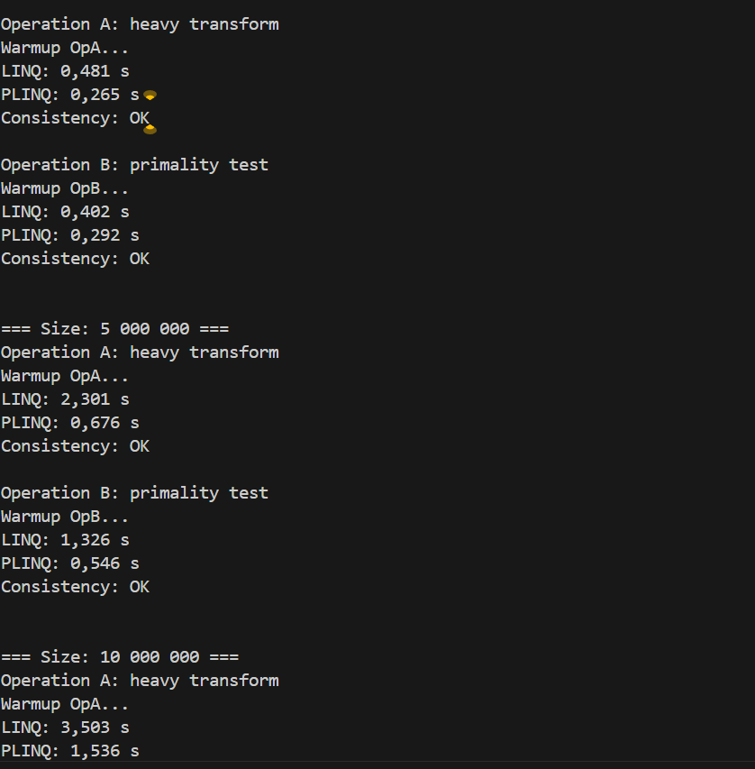

# IndependentWork12: PLINQ — дослідження продуктивності та безпеки

## Опис проєкту
Цей проєкт демонструє використання PLINQ (Parallel LINQ) для паралельної обробки колекцій у порівнянні зі звичайним LINQ.  
Мета — оцінити переваги та недоліки PLINQ щодо продуктивності та безпеки, а також продемонструвати потенційні проблеми потокобезпеки.

## Основні завдання
1. Створення великої колекції даних (List<int>) з 1M, 5M та 10M елементів.  
2. Виконання обчислювально інтенсивної операції над кожним елементом:
   - Перевірка на просте число (IsPrime)  
   - Обчислення квадратного кореня (Math.Sqrt)  
3. Порівняння продуктивності LINQ та PLINQ.  
4. Демонстрація потенційних побічних ефектів при паралельній обробці та їх виправлення за допомогою lock.  

## Технології
- C# (.NET 6 або вище)
- Visual Studio або VS Code
- PLINQ (System.Linq.Parallel)
- Stopwatch (System.Diagnostics.Stopwatch)

## Інструкції з запуску
1. Клонуйте репозиторій:

## Скрін
